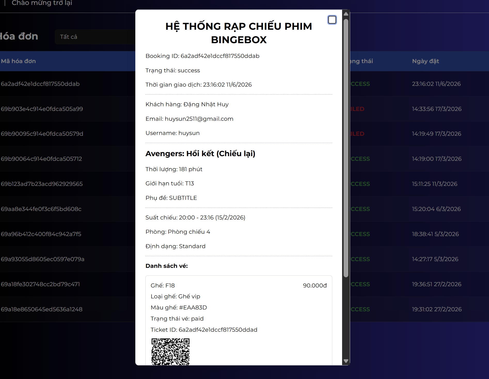
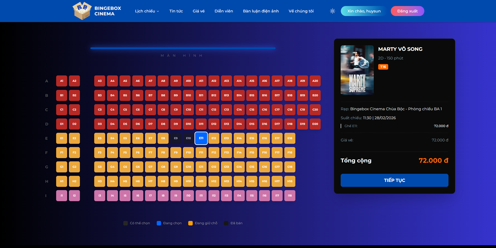
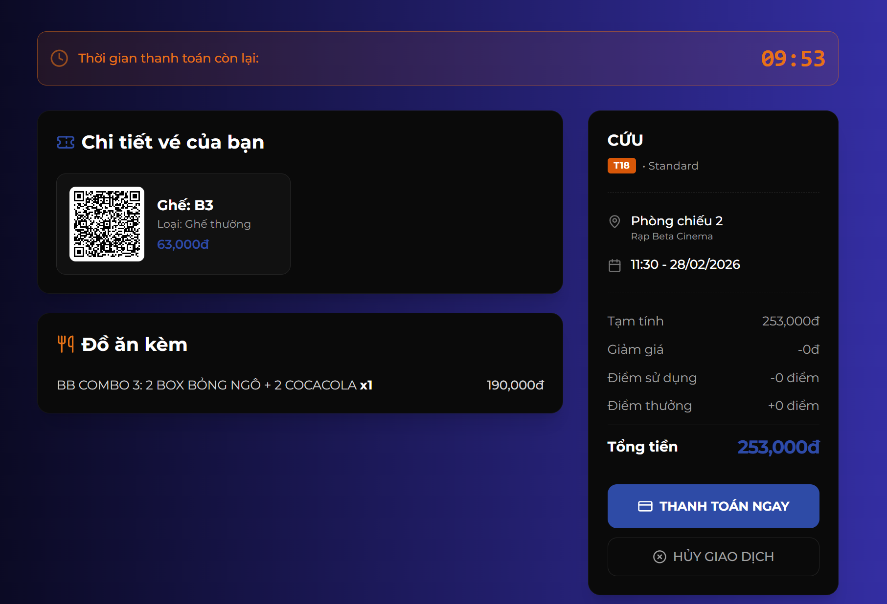
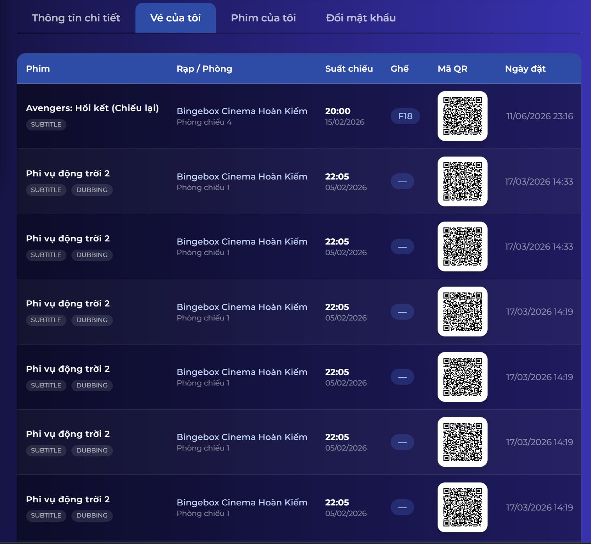
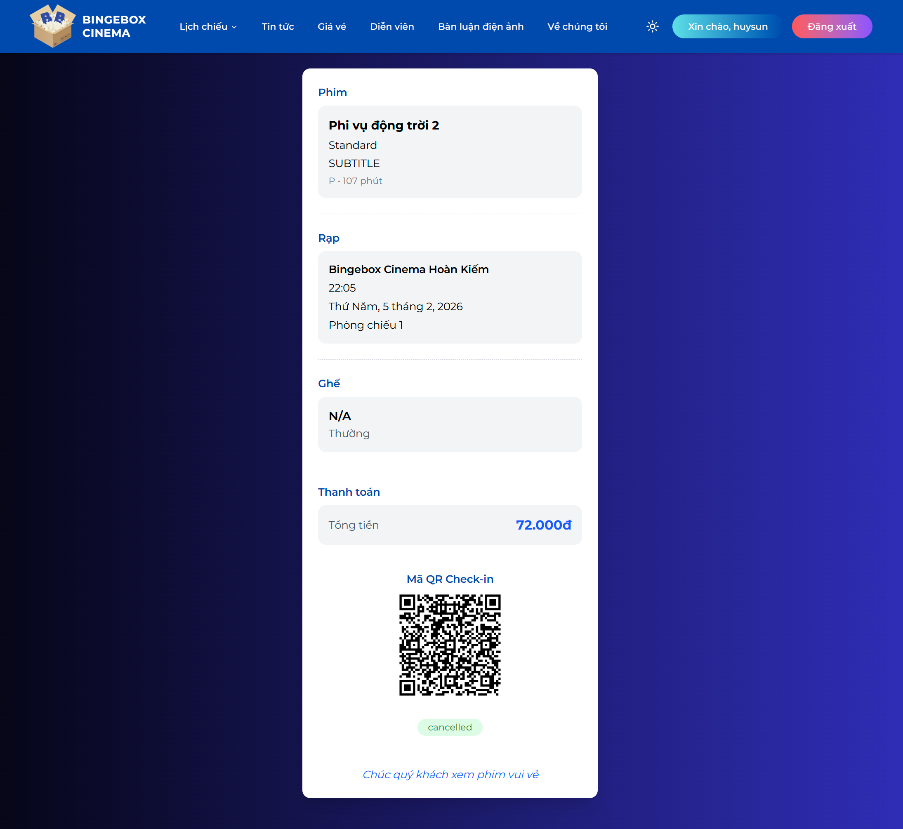

<div align="center">

# 🎬 BINGEBOX

### *A Modern Cinema Ticket Booking Platform*

[](https://nextjs.org/)
[](https://reactjs.org/)
[](https://www.typescriptlang.org/)
[](https://tailwindcss.com/)
[](https://socket.io/)

BingeBox là nền tảng đặt vé xem phim trực tuyến được phát triển với mục tiêu mang đến trải nghiệm đặt vé nhanh chóng, tiện lợi và hiện đại cho người dùng. Ứng dụng tích hợp đầy đủ các chức năng từ tra cứu lịch chiếu, chọn ghế theo thời gian thực, đặt combo bỏng nước cho đến hệ thống quản trị nội dung toàn diện.

</div>

---

## 📋 Mục lục

- [✨ Tính năng](#-tính-năng)
- [🛠️ Công nghệ sử dụng](#️-công-nghệ-sử-dụng)
- [📁 Cấu trúc dự án](#-cấu-trúc-dự-án)
- [🚀 Cài đặt & Chạy dự án](#-cài-đặt--chạy-dự-án)
- [⚙️ Biến môi trường](#️-biến-môi-trường)
- [📄 Các trang chính](#-các-trang-chính)
- [🔐 Xác thực & Phân quyền](#-xác-thực--phân-quyền)

---

## ✨ Tính năng

- 🎬 **Tra cứu lịch chiếu** – Xem lịch chiếu theo phim hoặc theo rạp
- 💺 **Chọn ghế thời gian thực** – Giữ ghế qua WebSocket, cập nhật trạng thái tức thì
- 🍿 **Đặt combo bỏng nước** – Thêm đồ ăn, thức uống vào đơn hàng
- 🎟️ **Đặt vé trực tuyến** – Quy trình đặt vé 3 bước: Ghế → Đồ ăn → Voucher
- 🎫 **Vé điện tử** – Quản lý vé đã mua, mã QR vé
- 💎 **Voucher & Ưu đãi** – Áp dụng mã giảm giá, voucher
- ⭐ **Điểm thành viên** – Tích lũy và sử dụng điểm thưởng
- ❤️ **Phim yêu thích** – Danh sách phim yêu thích, phim đã xem
- 💬 **Bình luận phim** – Đánh giá và thảo luận về phim
- 🛡️ **Bảng quản trị (Admin)** – Quản lý toàn bộ nền tảng
- 📊 **Thống kê & Dashboard** – Biểu đồ doanh thu, vé bán, khách hàng

---

## 🛠️ Công nghệ sử dụng

| Công nghệ | Phiên bản | Mô tả |
|---|---|---|
| [Next.js](https://nextjs.org/) | 16+ | Framework React với App Router |
| [React](https://reactjs.org/) | 19 | UI Library |
| [TypeScript](https://www.typescriptlang.org/) | 5+ | Type-safe JavaScript |
| [TailwindCSS](https://tailwindcss.com/) | 4 | Utility-first CSS framework |
| [TanStack Query](https://tanstack.com/query) | 5 | Server state & caching |
| [Zustand](https://zustand-demo.pmnd.rs/) | 5 | Lightweight state management |
| [Axios](https://axios-http.com/) | 1 | HTTP client với auto-refresh token |
| [Socket.IO Client](https://socket.io/) | 4 | Real-time seat selection |
| [React Hook Form](https://react-hook-form.com/) | 7 | Form management |
| [Zod](https://zod.dev/) | 4 | Schema validation |
| [Framer Motion](https://www.framer.com/motion/) | 12 | Animations |
| [Recharts](https://recharts.org/) | 2 | Data visualization |
| [TinyMCE React](https://www.tiny.cloud/) | 6 | Rich text editor |
| [Embla Carousel](https://www.embla-carousel.com/) | 8 | Touch slider / carousel |
| [date-fns](https://date-fns.org/) | 4 | Date utilities |
| [Sonner](https://sonner.emilkowal.ski/) | 2 | Toast notifications |
| [next-themes](https://github.com/pacocoursey/next-themes) | 0.4 | Dark/Light theme |
| [Radix UI](https://www.radix-ui.com/) | - | Accessible UI primitives |
| [TanStack Table](https://tanstack.com/table) | 8 | Data table |
| [Lucide React](https://lucide.dev/) | 0.56 | Icons |

---

## 📁 Cấu trúc dự án

```
bingebox_fe/
├── public/                    # Static assets (favicon, images)
├── src/
│   ├── app/                   # Next.js App Router
│   │   ├── (client)/          # Layout nhóm cho client
│   │   │   ├── (home)/        # Trang chủ
│   │   │   ├── aboutUs/       # Giới thiệu
│   │   │   ├── actor/         # Diễn viên
│   │   │   ├── blog/          # Tin tức
│   │   │   ├── booking/       # Đặt vé (chọn ghế, đồ ăn, voucher)
│   │   │   ├── comment/       # Bình luận phim
│   │   │   ├── movie/         # Chi tiết phim
│   │   │   ├── payment/       # Thanh toán
│   │   │   ├── price/         # Giá vé
│   │   │   ├── profile/       # Hồ sơ cá nhân
│   │   │   ├── showtime/      # Lịch chiếu (theo phim / theo rạp)
│   │   │   ├── ticket/        # Vé của tôi
│   │   │   └── ticketPrice/   # Bảng giá vé
│   │   ├── admin/             # Bảng quản trị (25 modules)
│   │   │   ├── overview/      # Dashboard & thống kê
│   │   │   ├── movie/         # Quản lý phim
│   │   │   ├── actor/         # Quản lý diễn viên
│   │   │   ├── category/      # Quản lý thể loại
│   │   │   ├── cinema/        # Quản lý rạp chiếu
│   │   │   ├── room/          # Quản lý phòng chiếu
│   │   │   ├── seat/          # Quản lý sơ đồ ghế + Editor
│   │   │   ├── showtime/      # Quản lý suất chiếu
│   │   │   ├── booking/       # Quản lý đặt vé
│   │   │   ├── user/          # Quản lý người dùng
│   │   │   ├── voucher/       # Quản lý voucher
│   │   │   ├── food/          # Quản lý đồ ăn
│   │   │   ├── blog/          # Quản lý tin tức (TinyMCE)
│   │   │   ├── setting/       # Cấu hình website
│   │   │   └── ...            # Các module khác
│   │   ├── auth/              # Xác thực (login, register, ...)
│   │   ├── layout.tsx         # Root layout
│   │   ├── not-found.tsx      # Trang 404
│   │   └── globals.css        # Global styles & theme variables
│   ├── components/
│   │   ├── admin/             # Components cho admin
│   │   │   ├── header/        # Admin header
│   │   │   ├── pagination/    # Data pagination
│   │   │   ├── sidebar/       # Admin sidebar
│   │   │   └── table/         # Data table
│   │   ├── client/            # Components cho client
│   │   │   ├── actor/         # Actor card & list
│   │   │   ├── blog/          # Blog card & list
│   │   │   ├── carousel/      # Homepage carousel
│   │   │   ├── footer/        # Footer
│   │   │   ├── header/        # Header
│   │   │   └── movie/         # Movie card & lists
│   │   ├── common/            # Components dùng chung
│   │   │   ├── confirm/       # Confirm dialog
│   │   │   ├── imagePreview/  # Image preview
│   │   │   ├── loading/       # Loading screen
│   │   │   ├── skeleton/      # Skeleton loaders
│   │   │   └── title/         # Section title
│   │   ├── provider/          # Context / Provider (Auth, Query)
│   │   └── ui/                # Shadcn/ui components (35 files)
│   ├── constants/             # Enums, filter options, provinces
│   ├── hooks/                 # Custom React hooks (5 files)
│   ├── lib/                   # Utility functions (cn)
│   ├── queries/               # TanStack Query hooks (27 files)
│   ├── schemas/               # Zod validation schemas (22 files)
│   ├── services/              # API service classes (27 files)
│   ├── stores/                # Zustand store (auth)
│   ├── types/                 # TypeScript type definitions
│   ├── utils/                 # Utilities (axios, socket, token, date)
│   └── middleware.ts          # Next.js middleware (auth guard)
├── .env                       # Biến môi trường
├── next.config.ts             # Cấu hình Next.js
├── package.json
└── tsconfig.json
```

---

## 🚀 Cài đặt & Chạy dự án

### Yêu cầu hệ thống

- **Node.js** >= 18.x
- **npm** >= 9.x hoặc **yarn** >= 1.22.x

### Bước 1: Clone dự án

```bash
git clone https://github.com/henruysun2511/BingeBox_Project.git
cd bingebox_fe
```

### Bước 2: Cài đặt dependencies

```bash
npm install
```

### Bước 3: Cấu hình biến môi trường

Tạo file `.env` tại thư mục gốc (hoặc copy từ `.env.example` nếu có):

```bash
cp .env.example .env
```

Sau đó cập nhật các giá trị trong file `.env` (xem phần [Biến môi trường](#️-biến-môi-trường)).

### Bước 4: Chạy môi trường phát triển

```bash
npm run dev
```

Ứng dụng sẽ chạy tại: **http://localhost:3000** (hoặc port khác nếu 3000 đã bị chiếm)

### Build cho Production

```bash
npm run build
npm run start
```

### Lint code

```bash
npm run lint
```

---

## ⚙️ Biến môi trường

Tạo file `.env` ở thư mục gốc dự án với nội dung sau:

```env
# URL API của backend
NEXT_PUBLIC_API_URL=http://localhost:4000/api/v1

# Secret key để xác thực JWT (dùng trong middleware)
ACCESS_TOKEN_SECRET=your_secret_key_here

# API Key của TinyMCE (rich text editor)
NEXT_PUBLIC_TINYMCE_KEY=your_tinymce_api_key_here
```

| Biến | Mô tả | Ví dụ |
|---|---|---|
| `NEXT_PUBLIC_API_URL` | Base URL của REST API backend | `http://localhost:4000/api/v1` |
| `ACCESS_TOKEN_SECRET` | Secret key dùng để verify JWT trong middleware | `your_secret_key` |
| `NEXT_PUBLIC_TINYMCE_KEY` | API Key từ [TinyMCE Cloud](https://www.tiny.cloud/) | `rz50e29x...` |

> **Lưu ý:** Các biến có tiền tố `NEXT_PUBLIC_` sẽ được expose ra phía client. Không đặt thông tin nhạy cảm vào các biến này.

---

## 📄 Các trang chính

### Client

| Route | Mô tả | Yêu cầu đăng nhập |
|---|---|---|
| `/` | Trang chủ | ❌ |
| `/movie/[id]` | Chi tiết phim | ❌ |
| `/showtime/movie` | Lịch chiếu theo phim | ❌ |
| `/showtime/movie/[id]` | Lịch chiếu của một phim | ❌ |
| `/showtime/cinema` | Lịch chiếu theo rạp | ❌ |
| `/booking/[id]` | Đặt vé (chọn ghế, đồ ăn, voucher) | ✅ |
| `/payment` | Thanh toán | ✅ |
| `/ticket` | Vé đã mua | ✅ |
| `/ticket/[id]` | Chi tiết vé | ✅ |
| `/price` | Bảng giá vé | ❌ |
| `/actor` | Danh sách diễn viên | ❌ |
| `/actor/[id]` | Chi tiết diễn viên | ❌ |
| `/blog` | Tin tức | ❌ |
| `/comment` | Bình luận điện ảnh | ❌ |
| `/profile` | Hồ sơ cá nhân | ✅ |
| `/aboutUs` | Về chúng tôi | ❌ |

### Xác thực

| Route | Mô tả | Yêu cầu đăng nhập |
|---|---|---|
| `/auth/login` | Đăng nhập | ❌ |
| `/auth/register` | Đăng ký | ❌ |
| `/auth/forgotPassword` | Quên mật khẩu | ❌ |
| `/auth/resetPassword` | Đặt lại mật khẩu | ❌ |

### Admin

| Route | Mô tả | Yêu cầu |
|---|---|---|
| `/admin/overview` | Dashboard tổng quan | Admin |
| `/admin/movie` | Quản lý phim | Admin |
| `/admin/actor` | Quản lý diễn viên | Admin |
| `/admin/category` | Quản lý thể loại | Admin |
| `/admin/cinema` | Quản lý rạp chiếu | Admin |
| `/admin/room` | Quản lý phòng chiếu | Admin |
| `/admin/seat` | Sơ đồ ghế & Editor | Admin |
| `/admin/showtime` | Quản lý suất chiếu | Admin |
| `/admin/booking` | Quản lý đặt vé | Admin |
| `/admin/user` | Quản lý người dùng | Admin |
| `/admin/voucher` | Quản lý voucher | Admin |
| `/admin/food` | Quản lý đồ ăn | Admin |
| `/admin/blog` | Quản lý tin tức | Admin |
| `/admin/setting` | Cấu hình website | Admin |
| `/admin/profile` | Hồ sơ admin | Admin |

---

## 🔐 Xác thực & Phân quyền

Dự án sử dụng **JWT (JSON Web Token)** lưu trong cookie (`accessToken`) để xác thực người dùng.

### Luồng xác thực (Middleware)

```
Request đến
    │
    ├─ Trang Auth (Login/Register) + Có token hợp lệ → Redirect về "/"
    │
    ├─ Trang Public (/, /movie, /showtime, /blog, ...) → Cho qua
    │
    ├─ Trang cần đăng nhập (/profile, /booking, /payment, /ticket) + Không có token → Redirect về "/auth/login"
    │
    ├─ Trang Admin (/admin) + Không có token → Redirect về "/auth/login"
    │
    ├─ Trang Admin (/admin) + Có token nhưng không phải ADMIN → Redirect về "/"
    │
    └─ Có token nhưng hết hạn → Xóa cookie + Redirect về "/auth/login"
```

### Phân quyền

- **Guest** – Xem trang chủ, lịch chiếu, phim, tin tức, diễn viên, bình luận
- **User** – Tất cả tính năng Guest + đặt vé, thanh toán, quản lý vé, hồ sơ, điểm thưởng
- **Admin** – Toàn quyền + truy cập bảng quản trị `/admin` (25 modules)

---

---
## 🛡️ Bảng quản trị (Admin)

Hệ thống quản trị gồm 25 module với các chức năng chính:

- **Dashboard** – Thống kê doanh thu, vé bán, phim top, khách hàng thân thiết
- **Quản lý phim** – CRUD phim, upload poster, trailer, phân loại
- **Quản lý diễn viên** – Thông tin diễn viên tham gia phim
- **Quản lý rạp/phòng** – Thiết lập rạp chiếu, phòng chiếu, sơ đồ ghế
- **Quản lý suất chiếu** – Xếp lịch chiếu cho từng phòng
- **Quản lý đặt vé** – Xem chi tiết đơn hàng, xác nhận thanh toán
- **Quản lý người dùng** – Quản lý tài khoản, phân quyền
- **Quản lý nội dung** – Tin tức (TinyMCE editor), voucher, đồ ăn
- **Cấu hình website** – Logo, tiêu đề, mô tả, favicon

<div style="display: flex; gap: 10px;">
  <div align="center">

<br>Quản lý phim
</div>

<div align="center">

<br>Quản lý suất chiếu theo từng phòng
</div>
</div>

<br>
<div align="center">

<br>Hóa đơn vé
</div>

---
## ⚙️ Chỉnh sửa sơ đồ ghế (Admin)
### Đặt vấn đề

Trong thực tế, sơ đồ ghế của một phòng chiếu phim không được thiết kế theo một khuôn mẫu cố định. Khác với mô hình lý tưởng dạng ma trận hình chữ nhật có số hàng và số cột đồng nhất, bố cục ghế trong các rạp chiếu phim thường rất đa dạng nhằm tối ưu hóa không gian và trải nghiệm của khán giả. Một số hàng có thể chứa ít ghế hơn các hàng khác, xuất hiện các khoảng trống ở giữa hoặc hai bên hàng ghế, thậm chí có những cột ghế được bố trí tách biệt để tạo lối đi. Bên cạnh đó, các loại ghế trong cùng một hàng cũng có thể khác nhau như ghế thường, ghế VIP hoặc ghế đôi, được sắp xếp xen kẽ tùy theo thiết kế của từng phòng chiếu.

Do đó, việc xây dựng một chức năng cho phép quản trị viên thiết kế và tùy chỉnh sơ đồ ghế một cách linh hoạt là yêu cầu cần thiết đối với hệ thống quản lý rạp chiếu phim. Chức năng này phải đáp ứng được các tình huống bố trí ghế đa dạng trong thực tế, đồng thời đảm bảo dữ liệu sơ đồ ghế được quản lý chính xác để phục vụ cho quá trình đặt vé, tính giá và quản lý phòng chiếu.

### Chức năng chỉnh sửa sơ đồ ghế

Chức năng chỉnh sửa sơ đồ ghế là một mô-đun quan trọng thuộc phân hệ quản trị của hệ thống quản lý rạp chiếu phim. Mô-đun này cho phép người quản trị thiết kế, cập nhật và tùy chỉnh sơ đồ ghế cho từng phòng chiếu thông qua giao diện trực quan. Việc quản lý chính xác sơ đồ ghế đóng vai trò quan trọng trong quá trình đặt vé, giúp khách hàng lựa chọn vị trí phù hợp và hỗ trợ hệ thống xác định giá vé dựa trên loại ghế tương ứng.

### Mục tiêu của chức năng

* Cho phép quản trị viên thiết kế và quản lý sơ đồ ghế riêng cho từng phòng chiếu.
* Hỗ trợ nhiều loại ghế khác nhau như ghế thường (Standard), ghế VIP và ghế đôi (Couple Seat), đồng thời hiển thị bằng các màu sắc phân biệt.
* Cho phép thêm, xóa và sắp xếp các hàng ghế hoặc từng ghế riêng lẻ một cách linh hoạt.
* Hỗ trợ tạo ghế đôi bằng cách ghép hai ghế liền kề thành một đơn vị ghế đôi.
* Cho phép thêm hoặc xóa các ô trống nhằm mô phỏng chính xác bố cục thực tế của phòng chiếu.
* Tự động tính toán và cập nhật các thông tin của sơ đồ phòng như số hàng, số cột và tổng số ghế hiện có.
* Đảm bảo tính toàn vẹn dữ liệu bằng cách ngăn chặn việc chỉnh sửa sơ đồ ghế khi phòng chiếu đang có suất chiếu hoạt động.

<div style="display: flex; gap: 10px;">
  
  
</div>

<br>

<div align="center">
  
</div>

---
## 💺 Chọn ghế thời gian thực (WebSocket)

Để tránh tình trạng nhiều người dùng cùng chọn một ghế trong cùng một suất chiếu, hệ thống triển khai cơ chế đồng bộ trạng thái ghế theo thời gian thực bằng Socket.IO. Mọi thay đổi về trạng thái ghế đều được cập nhật ngay lập tức đến tất cả người dùng đang truy cập cùng suất chiếu, giúp đảm bảo tính nhất quán của dữ liệu và nâng cao trải nghiệm đặt vé.

### Tính năng chính
- Đồng bộ trạng thái ghế theo thời gian thực giữa nhiều người dùng.
- Tạm giữ ghế khi người dùng lựa chọn ghế.
- Tự động giải phóng ghế khi người dùng hủy chọn hoặc rời khỏi trang.
- Cập nhật tức thời trạng thái ghế cho tất cả người dùng trong cùng suất chiếu.
- Ngăn chặn việc nhiều người dùng đặt cùng một ghế.
- Tự động thu hồi các ghế đang giữ khi người dùng mất kết nối hoặc đóng trình duyệt.

### Quy trình hoạt động
- Người dùng chọn một ghế trên giao diện đặt vé.
- Client gửi sự kiện seat:hold đến máy chủ.
- Máy chủ đánh dấu ghế ở trạng thái đang giữ và thông báo đến tất cả người dùng khác trong cùng suất chiếu.
- Các người dùng khác sẽ nhìn thấy ghế đó ở trạng thái không khả dụng và không thể lựa chọn.
- Khi người dùng bỏ chọn ghế hoặc rời khỏi trang:
- Client gửi sự kiện seat:release.
- Máy chủ giải phóng ghế.
- Trạng thái mới được đồng bộ đến tất cả người dùng đang kết nối.
- Khi thanh toán thành công, ghế được chuyển sang trạng thái đã đặt và không thể thay đổi.

### Nhược điểm
- Khi làm xong , tôi nhận thấy rằng nếu lượng người dùng truy cập quá tải cao thì ghế sẽ bị giữ hàng loạt, realtime socket sẽ tốn chi phí, server cũng sẽ không tải được.
- Tôi sẽ nghiên cứu về xử lý hàng đợi trong tương lai.




---
## 🏷️ Nghiệp vụ tính giá vé
### Đặt vấn đề

Trong thực tế, giá vé không chỉ quyết định bởi loại ghế mà còn ảnh hưởng bởi độ tuổi khách hàng (ví dụ: nhỏ tuổi thì sẽ rẻ hơn), định dạng phòng (imax đắt hơn), khung giờ chiếu (chiếu đêm đắt hơn), thứ trong tuần (thứ bảy, chủ nhật đắt hơn ngày thường)

### Chức năng tính giá vé

Chức năng tính giá vé là một mô-đun nghiệp vụ cốt lõi của hệ thống BINGEBOX, chịu trách nhiệm xác định giá tiền của mỗi vé xem phim dựa trên tập hợp các tiêu chí được cấu hình sẵn. Mô-đun này đảm bảo việc tính giá được thực hiện thống nhất giữa giao diện người dùng và hệ thống xử lý phía máy chủ, từ đó tránh các sai lệch trong quá trình đặt vé và thanh toán.
Giá vé được xác định dựa trên năm yếu tố chính:
- Loại ghế (Standard, VIP, Couple Seat,...)
- Định dạng phòng chiếu (2D, 3D, IMAX,...)
- Khung giờ chiếu
- Thứ trong tuần
- Nhóm tuổi của khách hàng

#### Quy trình thực hiện:

1. Lấy thông tin ghế đã chọn để xác định loại ghế.
2. Lấy thông tin suất chiếu để xác định khung giờ và ngày chiếu.
3. Lấy thông tin phòng chiếu để xác định định dạng phòng (Standard, IMAX,...).
4. Tính tuổi người dùng và phân loại vào nhóm tuổi phù hợp.
5. Xác định thứ trong tuần từ thời gian chiếu.
6. Tra cứu bảng giá theo tổ hợp các điều kiện trên.
7. Trả về giá vé cuối cùng để hiển thị và sử dụng trong quá trình thanh toán.

---
## 💳 Nghiệp vụ thanh toán

Quy trình thanh toán là nghiệp vụ trung tâm của hệ thống BINGEBOX, bao gồm toàn bộ hành trình từ chọn ghế, chọn đồ ăn, áp dụng ưu đãi đến thanh toán và nhận vé điện tử. Hệ thống sử dụng Socket.IO để đồng bộ trạng thái ghế theo thời gian thực, giúp ngăn chặn tình trạng nhiều người dùng đặt cùng một ghế.

### Đặc điểm nổi bật
- Đồng bộ trạng thái ghế theo thời gian thực bằng Socket.IO.
- Cơ chế giữ ghế tự động trong 10 phút.
- Tính giá vé dựa trên nhiều yếu tố (loại ghế, độ tuổi, phòng chiếu, khung giờ, ngày trong tuần).
- Hỗ trợ voucher, điểm thành viên và ưu đãi hạng hội viên.
- Tạo mã QR riêng cho từng vé phục vụ kiểm soát vé tại rạp.
- Xử lý đặt vé trong MongoDB Transaction nhằm đảm bảo tính toàn vẹn dữ liệu.

### Quy trình thanh toán
#### Bước 1: Chọn ghế
Người dùng lựa chọn ghế trên sơ đồ phòng chiếu.
- Ghế trống (AVAILABLE) có thể được chọn.
- Ghế đang giữ (HOLD) không thể chọn.
- Ghế đã bán (SOLD) không thể chọn.
Khi chọn ghế, hệ thống tạm giữ ghế và tính trước giá vé theo các chính sách giá hiện hành.

#### Bước 2: Chọn đồ ăn
Người dùng có thể chọn thêm các sản phẩm như bắp rang, nước ngọt hoặc combo để bổ sung vào đơn hàng.

#### Bước 3: Áp dụng ưu đãi
Hệ thống hỗ trợ:
- Sử dụng voucher giảm giá.
- Quy đổi điểm thành viên.
- Áp dụng chiết khấu theo hạng hội viên.

#### Bước 4: Tạo đơn đặt vé
Hệ thống thực hiện:
- Kiểm tra tính hợp lệ của ghế và suất chiếu.
- Tính tổng tiền vé và đồ ăn.
- Áp dụng các chương trình ưu đãi.
- Tạo đơn đặt vé ở trạng thái PENDING.
- Sinh vé điện tử và mã QR cho từng ghế đã đặt.

#### Bước 5: Thanh toán
Người dùng thực hiện thanh toán trên trang thanh toán.

Thanh toán thành công:
- Đơn hàng chuyển sang trạng thái SUCCESS.
- Vé được xác nhận và kích hoạt.
- Điểm thưởng được cộng vào tài khoản.
- Trạng thái ghế được cập nhật thành SOLD.

Thanh toán thất bại hoặc hết thời gian giữ ghế:
- Đơn hàng chuyển sang trạng thái FAILED hoặc CANCELLED.
- Ghế được giải phóng và mở lại cho người dùng khác đặt.
- Điểm thành viên đã sử dụng được hoàn trả (nếu có).

Công thức tính tiền
```
Tổng tiền = Tiền vé + Tiền đồ ăn

Giảm giá = Voucher
         + Điểm thành viên
         + Ưu đãi hạng hội viên

Thành tiền = Tổng tiền - Giảm giá
```

<div align="center">

</div>

### Nhược điểm
- Đây mới chỉ là thanh toán giả lập, tôi sẽ nghiên cứu áp dụng webhook trong tương lai.

---
## 🎬 Vé cá nhân (User)
Người dùng truy cập trang hồ sơ để theo dõi và quản lý toàn bộ các vé đã đặt. Tại đây, người dùng có thể xem danh sách vé theo từng suất chiếu cùng các thông tin liên quan như tên phim, thời gian chiếu, phòng chiếu, vị trí ghế và trạng thái vé.

Mỗi vé được hệ thống tạo một mã QR duy nhất nhằm phục vụ cho quá trình xác thực khi khách hàng đến rạp. Mã QR được liên kết với thông tin chi tiết của vé trong cơ sở dữ liệu. Khi thực hiện quét mã QR bằng thiết bị kiểm soát vé, hệ thống sẽ truy xuất và hiển thị đầy đủ các thông tin liên quan như mã vé, thông tin suất chiếu, vị trí ghế, thời gian đặt vé và trạng thái sử dụng.

<div style="display: flex; gap: 10px;">
  
  
</div>

---
<br>
<div align="center">

Made by **NHAT HUY**

</div>
